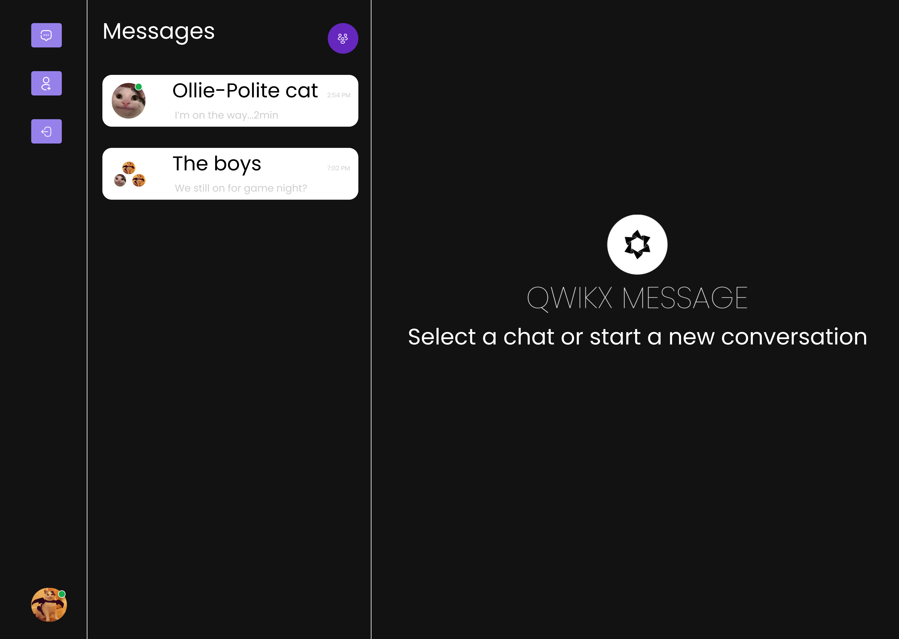

# Qwikx Messenger

Qwikx Messenger is a real-time messaging app that brings instant
communication to life! Powered by Next.js, Prisma, and MongoDB,
Qwikx Messenger offers vibrant one-on-one conversations and dynamic
group chats at your fingertips. Say goodbye to delays and hello to
lightning-fast updates that keep you in sync with friends, family,
and colleagues.With its sleek and user-friendly interface,
navigating through conversations, customizing your profile, and
managing contacts becomes a breeze. Rest assured, your privacy and
security are our top priorities. We employ industry-standard
encryption protocols, ensuring your data and conversations are safe
and secure.

## Demo

https://nextjs-qwikx-messenger.vercel.app/

## Technologies Used

- [Next.js 14](https://nextjs.org/)
- [Tailwind CSS](https://tailwindcss.com/)
- [Prisma](https://www.prisma.io/)
- [MongoDB](https://www.mongodb.com/)

## Installation

- npm install
